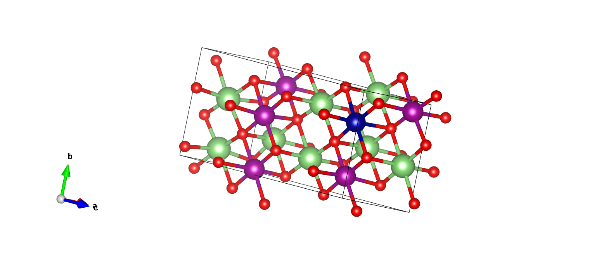
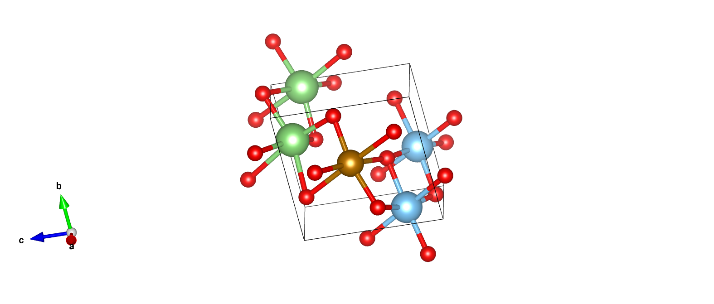
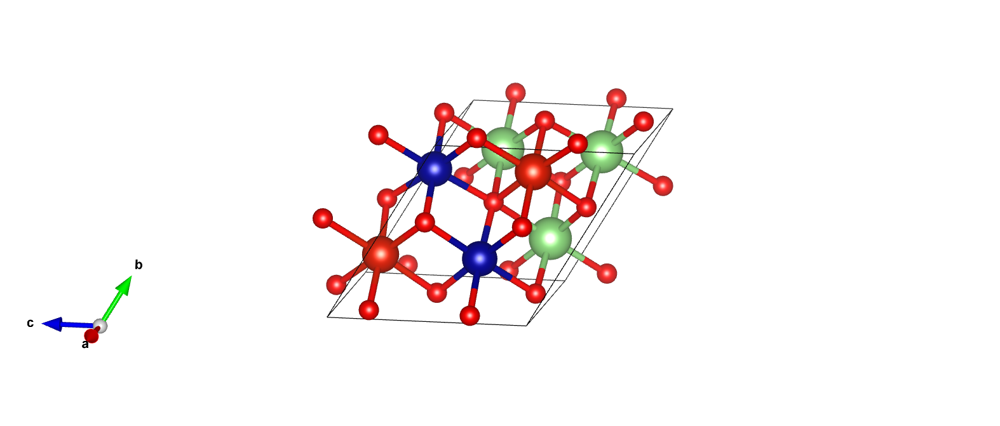
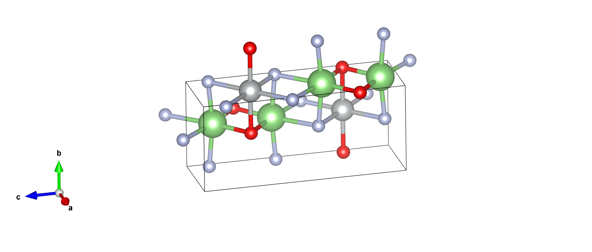

# Project Results (项目成果展示)

本目录归档了本项目在模型训练和三维晶体生成阶段的核心产出数据与可视化图表。

---

## 1. CGCNN 模型训练成果 (Property Prediction Results)

在探索固态电解质属性预测模型的过程中，我们通过架构优化与超参数调优，成功获得了一个能够有效抑制过拟合且精度优异的预测模型。
核心成果保存在 `epoch200_upgrade_batch/` 文件夹中，包含最佳权重 `model_best.pth.tar`、训练日志 `train_log.txt` 以及测试集预测结果 `test_results.csv`。

**最佳模型超参数组合与性能：**
* **Epoch:** 200
* **Batch Size:** 64
* **学习率动态调度:** Epoch 0-100: `0.005` | 100-150: `0.0005` | 150-200: `0.00005`
* **权重衰减系数 (L2 Regularization):** 10^-4
* **网络正则化:** 引入 Dropout 层 (p=0.2，位于池化层后、全连接层前)
* **最终性能:** 最佳模型精度 **MAE = 0.181V** (于 Epoch 158 取得)，过拟合程度控制在 30%，训练集与验证集 MAE 差距缩小至 0.055V。

*(注：训练过程的 Loss 衰减曲线与 MAE 性能图已上传至当前目录，以供直观对比参考。)*

---

## 2. CDVAE 晶体生成与弛豫结构 (Generated & Relaxed Materials)

本模块展示了 AI 扩散模型在三维空间中创造的新型固态电解质晶体候选物。为了便于审阅，所有 CIF 结构文件已打包为压缩包，并附带了部分极品材料的 VESTA 三维渲染图。

生成工作流分为三个递进的阶段：
*  **`Generated_cifs.zip` (无条件生成):** 包含 100 个由模型初步学习锂离子电解质空间拓扑后，自由探索生成的原始材料结构。
*  **`Generated_Electrolytes_prop.zip` (属性条件生成):** 包含 352 个在引入特定属性条件引导后，定向生成的高潜力电解质结构（未经力场优化，可能存在局部原子过近）。
*  **`Relaxed_Generated_Electrolytes_prop.zip` (极速结构弛豫):** 上述 352 个条件生成材料在经过机器学习力场初步优化后的形态，旨在消除晶格应力与原子碰撞。

*(每个分类下均精选了 10 张左右 VESTA 结构渲染图，直观展示 AI 生成的多阴离子骨架与锂离子传导通道。)*
---
---

## 📸 晶体结构可视化 (Structure Visualization)

本项目生成的候选材料已通过 VESTA 进行了高精度渲染。展示分为两个阶段：初始生成的探索性结构（Generated）与经过机器学习力场弛豫后的稳态结构（Relaxed）。

### 1. 核心精选展示 (Top Highlights)
我们从 **23 个** 精选渲染图中挑选了 3 个最具代表性的结构。这些材料在保持了高对称性的同时，展现了清晰的锂离子三维扩散通道。

---

## 📸 核心晶体结构展示 (Featured Crystal Structures)

本项目从生成库中精选了 4 个具有代表性的结构。这些案例不仅展示了 CDVAE 在无约束空间下的探索能力，也体现了经过属性定向优化（Conditional Generation）与 CHGNet 物理弛豫后的稳态结构特征。

| 结构状态 (Status) | 典型渲染图 (Representative Image) | 化学式与亮点 (Formula & Features) |
| :--- | :---: | :--- |
| **初始生成态 (Unconditional)** |  | **Li₈Mn₅Cr₁O₁₄**：超高锂含量的富锂氧化物骨架。展示了 AI 在无标签约束下对复杂三维锂离子扩散网络的空间构筑能力，结构具有良好的长程对称性。 |
| **初始生成态 (Unconditional)** |  | **Li₂Ti₂Fe₁O₇**：典型的过渡金属氧化物框架。AI 成功捕捉到了稳定的多面体连接模式，为寻找新型低成本固态电解质提供了多样化的结构原型。 |
| **对比优化态 (Optimized)** |  | **Li₃V₂Cr₂O₈**：经过属性定向优化（带隙/形成能约束）并由 **CHGNet** 弛豫。结构在保持拓扑特征的同时，原子间距更符合物理稳态。 |
| **弛豫后稳态 (Relaxed)** |  | **Li₄Ni₂O₂F₄**：**含氟高压体系**。通过定向引入氟元素显著提升了理论电化学窗口，弛豫后阴离子骨架排布致密，是高电压固态电池的理想候选材料。 |

> [!NOTE]
> **数据说明**：
> * 所有展示结构均已通过化学组分过滤，剔除了 C, H, Cs 等不稳定或高环境敏感性元素。
> * 更多优化细节及完整的渲染图库，请访问 [初始生成库](./Generated_cifs_img/) 与 [弛豫优化库](./Relaxed_Generated_Electrolytes_prop_img/)。
> * 您可以下载目录下的 `.cif` 文件并使用 **VESTA** 软件进行多面体连接性与空隙率的定量分析。

> [!TIP]
> **如何查看更多？**
> *  **初始生成结构库**：查看 [`./Generated_cifs_img/`](./Generated_cifs_img/) 文件夹（内含 13 张精选图片）。
> *  **优化后性能结构库**：查看 [`./Relaxed_Generated_Electrolytes_prop_img/`](./Relaxed_Generated_Electrolytes_prop_img/) 文件夹（内含 10 张精选图片）。
> *  **深度交互**：您可以下载本目录下的 `.cif` 压缩包，并使用 **VESTA** 或 **CrystalMaker** 软件手动打开，以进行任意角度的旋转、配位多面体分析及孔道尺寸测量。

---

